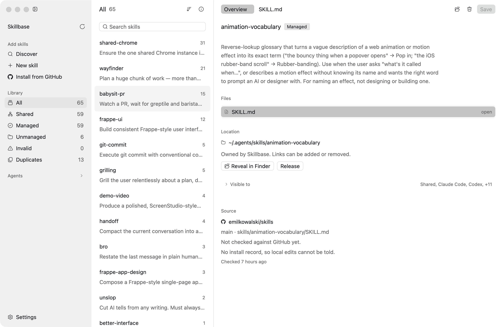

# Skillbase

A desktop app for managing [Agent Skills](https://agentskills.io) across every
coding agent on your machine.



Every agent reads skills from a different place. Claude Code looks in
`~/.claude/skills`, Codex in `~/.codex/skills`, Goose in
`~/.config/goose/skills`, and so on. Skillbase keeps one copy of each skill and
symlinks it into the directories of the agents that should see it. Which agents
can see a skill is a row of switches, not a directory tree you maintain by hand.

It knows fourteen agents: Claude Code, Codex, Cursor, Gemini CLI, opencode,
Goose, Amp, GitHub Copilot, Zed, Cline, JetBrains Junie, Warp, Kiro, and Devin.
Twelve of them also read the vendor-neutral `~/.agents/skills`, which is where
Skillbase keeps the copy it owns.

## What it does

**Finds what is already there.** Scanning is read-only and covers 16 known
locations. Nothing moves until you ask.

**Installs from GitHub and tells you when there is an update.** Search
skills.sh, or point Skillbase at a repository, a directory inside it, and
optionally a branch. What comes down is pinned to a commit, and its origin is
written into the skill's own `SKILL.md` under `metadata`, using the same four
keys that `gh skill install` writes. Skills installed by `npx skills` are picked
up from its lockfile.

Update checks compare the tree sha of the skill's own directory, so a skill is
only out of date when the skill itself changed. If you edited a skill locally
and it also changed upstream, Skillbase says so and waits for you to choose.

**Edits skills in place.** `SKILL.md` opens in a syntax-highlighted editor, and
the Overview tab shows its frontmatter as name and description fields. Saving an
unchanged file writes it back byte for byte. Comments, quote style, block
scalars, and key order all survive. A skill whose YAML does not parse still
opens, so you can fix it.

**Opens the rest of the directory too.** The Overview lists the skill directory
as a tree. Any text file opens in its own tab and saves back verbatim. Markdown,
YAML, TOML, shell, and Python are highlighted. Binaries are listed but not
opened.

**Controls visibility per agent.** One switch per agent links or unlinks that
agent's directory. Codex can also disable a skill through `~/.codex/config.toml`
and Claude Code through a `skills-disabled` directory. Skillbase uses each
agent's own mechanism and says which one it is using.

**Consolidates duplicates.** Most people start by copying a skill into every
agent directory, and the copies drift. Skillbase compares each duplicate against
the origin and replaces the identical ones with symlinks. A copy whose content
differs is listed and left alone, because that difference is an edit somebody
made. Overriding it takes one checkbox per directory.

**Counts what you use.** The list sorts by name or by how often each skill has
been invoked. Only Claude Code and GitHub Copilot CLI record invocations, so a
zero for the other agents means "not measurable" rather than "unused". Claude
Code keeps transcripts for 30 days, so the count is recent history. The first
count walks the transcripts on a background thread. After that it resumes from
`~/.skillbase/usage.json`.

**Leaves other tools alone.** A skill whose directory is not in Skillbase's
store is unmanaged. You can read and edit it in place, but its visibility stays
read-only until you adopt it. If another tool fans your skills out, Skillbase
will not fight it.

## Install

Skillbase runs on macOS 11 or newer and on Linux, on both Apple silicon and
Intel, and on both x86_64 and aarch64 Linux. Every build is on the
[releases page](https://github.com/netchampfaris/skillbase/releases).

**macOS.** Open the `.dmg` for your Mac and drag Skillbase to Applications.
These builds are signed ad-hoc rather than with a Developer ID, so Gatekeeper
stops the first launch. Right-click the application and choose Open, or clear
the quarantine flag yourself:

```sh
xattr -dr com.apple.quarantine /Applications/Skillbase.app
```

**Linux.** Unpack the tarball and run the installer inside it, which copies the
binary, the icon and the desktop entry under `~/.local`:

```sh
tar xzf skillbase-*-linux-x86_64.tar.gz
cd skillbase-*-linux-x86_64
./install.sh
```

`SHA256SUMS` on the release covers every file.

### Build it yourself

Building needs Rust 1.98 or newer.

```sh
git clone https://github.com/netchampfaris/skillbase.git
cd skillbase
cargo run
```

On macOS, `cargo run` gives you a process, not an application. To get an icon
and something Spotlight can find:

```sh
cargo build --release
script/bundle-macos.sh release --install
```

That writes `~/Applications/Skillbase.app` with the binary copied in, so it
keeps working after `cargo clean` or after this checkout moves. Run the same
command again to update it.

Without `--install`, the bundle goes to `target/<profile>/Skillbase.app` and
symlinks the binary, so a plain `cargo build` refreshes it. Use that while
developing.

## Development

The workspace has two crates.

| Path            | What it holds                                                                   |
| --------------- | ------------------------------------------------------------------------------- |
| `crates/core`   | Discovery, the agent registry, install operations, `SKILL.md` parsing. No GPUI. |
| `src`           | The interface: sidebar, list, detail pane, settings.                            |
| `script`        | Bundling, icon generation, and screenshot scripts.                              |
| `docs/SPEC.md`  | The design contract, including the full agent table.                            |
| `assets/themes` | The light and dark palettes.                                                    |
| `assets/icons`  | The icon set and the agent brand marks, each with a `SOURCES.md`.               |

The tests live in `crates/core`, which does not depend on the UI, so the
filesystem behavior runs without a window:

```sh
cargo test --workspace
```

A few tests talk to GitHub and are skipped by default:

```sh
cargo test -p skillbase-core --test live_github -- --ignored
```

### A throwaway home

Every path Skillbase reads or writes resolves under one home directory, and
`SKILLBASE_HOME` overrides it:

```sh
SKILLBASE_HOME=/tmp/fakehome cargo run
```

The title bar shows an orange badge naming the override. Use this for anything
destructive.

### Screenshots without stealing focus

Launching the app to look at a change brings its window to the front and takes
the keyboard from whoever is typing. `script/preview.sh` builds, restarts, and
captures Skillbase without doing that:

```sh
script/preview.sh                  # a PNG under $TMPDIR, path printed
script/preview.sh shots/list.png   # or a path you choose
script/preview.sh --stop           # shut the preview copy down
```

It launches the bundle with `open -g` and `SKILLBASE_NO_ACTIVATE=1`, then reads
the window's own buffer with `screencapture -l`, so the window can stay behind
everything else. The terminal needs Screen Recording permission, granted once
in System Settings. The script refuses to capture while the window is on an
inactive Space, because macOS would hand back a stale frame. The header of the
script has the details.

### Icons

The application icon, `assets/icon.png`, is generated:

```sh
python3 script/make-icon.py
```

The interface uses HugeIcons in its stroke-rounded variant, served from
`assets/icons` in place of the Lucide set bundled with `gpui-kit`. The agent
logos in `assets/icons/agents` come from Simple Icons and lobe-icons. They are
trademarks of their owners and are used only to label each agent in the list.
Both `SOURCES.md` files have the per-file detail.

### Releases

Merging into `main` publishes a release. `.github/workflows/release.yml` builds
the four artifacts, tags the commit, and writes the notes from the pull
requests that landed since the last tag.

The version comes from `script/next-version.sh`, which takes the newest tag,
raises its patch number by one, and uses that unless `Cargo.toml` already
declares something larger. So an ordinary merge moves 0.1.3 to 0.1.4 and needs
no thought. To cut a feature version instead, set the version in `Cargo.toml`
to 0.2.0 in the pull request that earns it, and the manifest wins. The major
number is never raised by the workflow; 1.0.0 is a decision, and it is made the
same way, by editing the manifest.

Only a push to `main` publishes. A pull request that touches the release
machinery builds all four artifacts and attaches them to the run without
tagging anything, and so does a run started by hand from the Actions tab. That
is how a change to any of this gets tested before it is trusted.

Signing is ad-hoc until five repository secrets exist — `MACOS_CERTIFICATE`,
`MACOS_CERTIFICATE_PASSWORD`, `APPLE_ID`, `APPLE_APP_PASSWORD` and
`APPLE_TEAM_ID`. With them the workflow signs with the Developer ID in the
certificate and notarises the disk images, and the quarantine step above stops
being necessary. Nothing else has to change.

## Not in v1

Project-scoped skills, publishing to a registry, and Windows.

## License

MIT or Apache-2.0, at your option.
