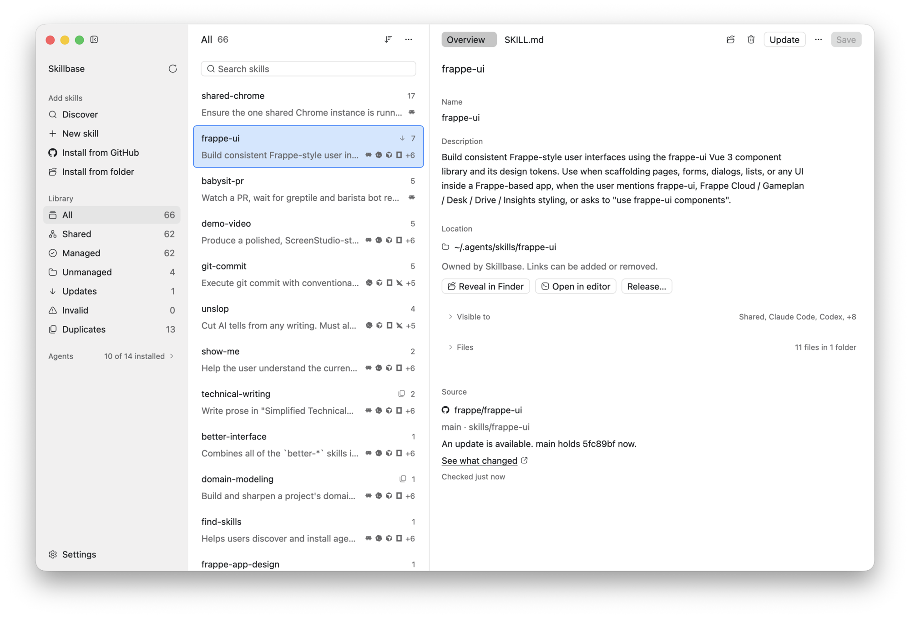
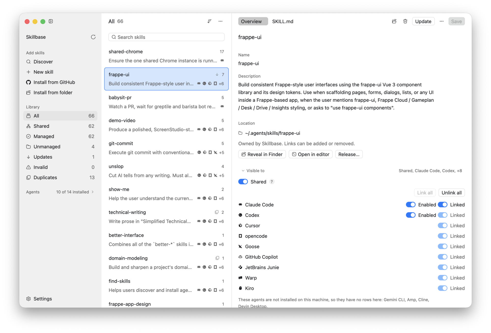
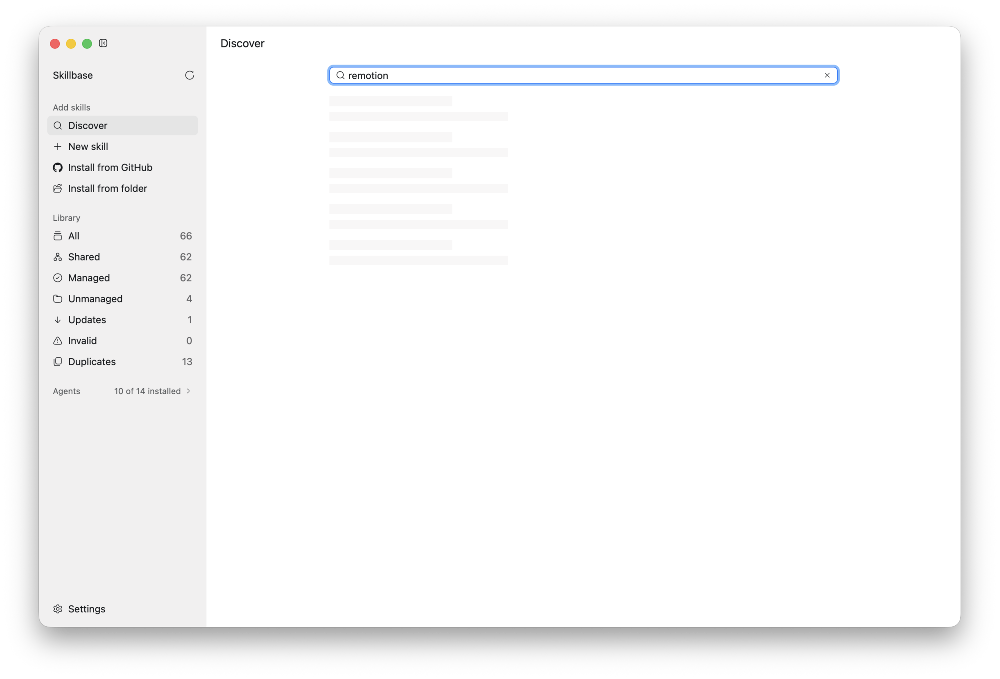
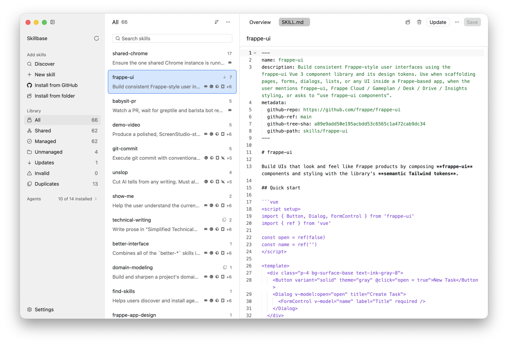
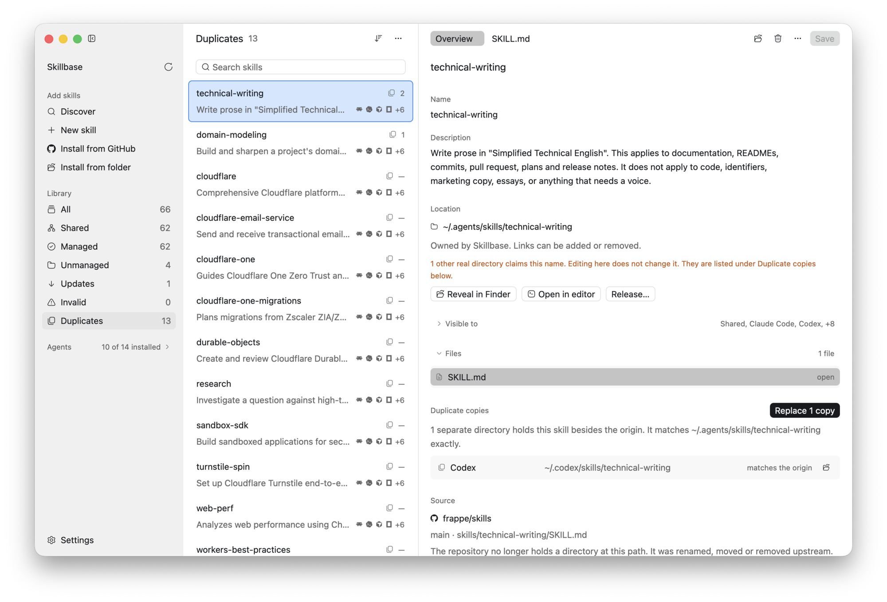

# Skillbase

A desktop app that manages [Agent Skills](https://agentskills.io) for every
coding agent on your machine.

<picture>
  <source media="(prefers-color-scheme: dark)" srcset="docs/images/hero-dark.png">
  
</picture>

Every agent reads skills from a different directory. Claude Code reads
`~/.claude/skills`, Codex reads `~/.codex/skills`, Goose reads
`~/.config/goose/skills`. Skillbase keeps one copy of each skill in
`~/.agents/skills` and symlinks it into the directories of the agents that
should see it.

https://github.com/user-attachments/assets/5389cb6d-3fa9-4332-9874-b730ce9da8e7

It supports 14 agents: Claude Code, Codex, Cursor, Gemini CLI, opencode, Goose,
Amp, GitHub Copilot, Zed, Cline, JetBrains Junie, Warp, Kiro, and Devin.

## Features

### Choose which agents see a skill

Each skill has one switch per agent. A switch links or unlinks the skill in that
agent's directory. Where an agent has its own way to disable a skill, as Codex
and Claude Code do, Skillbase uses it.

<picture>
  <source media="(prefers-color-scheme: dark)" srcset="docs/images/visibility-dark.png">
  
</picture>

### Install from GitHub and get updates

Search [skills.sh](https://skills.sh), or give Skillbase a GitHub repository.
Skillbase pins each install to a commit and records the source in the
`SKILL.md` of the skill, with the same keys that `gh skill install` writes. It
reports an update only when the directory of the skill changed upstream. If you
also edited the skill locally, Skillbase asks which version to keep.

<picture>
  <source media="(prefers-color-scheme: dark)" srcset="docs/images/discover-dark.png">
  
</picture>

### Edit skills in place

`SKILL.md` opens in an editor with syntax highlighting, and so does every other
text file in the skill directory. Skillbase saves an unchanged file byte for
byte, so comments, quote style, and key order stay as they were. A skill with
invalid YAML still opens, so you can fix it.

<picture>
  <source media="(prefers-color-scheme: dark)" srcset="docs/images/editor-dark.png">
  
</picture>

### Clean up duplicates

Skills copied into several agent directories drift apart. Skillbase compares
each copy with the original and replaces the identical copies with symlinks. It
lists a copy that differs and leaves it alone, because the difference is an edit
that somebody made.

<picture>
  <source media="(prefers-color-scheme: dark)" srcset="docs/images/duplicates-dark.png">
  
</picture>

### See which skills you use

Sort the list by how often each skill ran. Only Claude Code and GitHub Copilot
CLI record this, so a zero for another agent means "not measurable". Claude Code
keeps about 30 days of history, so the count covers that period.

### Nothing changes until you ask

Scanning only reads. A skill that Skillbase did not install stays where it is.
You can read and edit it, and its visibility switches stay locked until you
adopt it.

## Install

Skillbase runs on macOS 11 or newer and on Linux, on Apple silicon, Intel, and
aarch64. Download a build from the
[releases page](https://github.com/netchampfaris/skillbase/releases).

### macOS

Open the `.dmg` and drag Skillbase to Applications. The builds do not have a
Developer ID signature yet, so Gatekeeper stops the first launch. Right-click
the app and choose Open, or clear the quarantine flag:

```sh
xattr -dr com.apple.quarantine /Applications/Skillbase.app
```

### Linux

Unpack the tarball and run the installer. It copies the binary, the icon, and
the desktop entry to `~/.local`.

```sh
tar xzf skillbase-*-linux-x86_64.tar.gz
cd skillbase-*-linux-x86_64
./install.sh
```

`SHA256SUMS` on the release covers every file.

### From source

This needs Rust 1.98 or newer.

```sh
git clone https://github.com/netchampfaris/skillbase.git
cd skillbase
cargo run
```

[docs/DEVELOPMENT.md](docs/DEVELOPMENT.md) covers the macOS app bundle, the
tests, and the release process. [docs/SPEC.md](docs/SPEC.md) is the design
contract, and [docs/USER-STORIES.md](docs/USER-STORIES.md) lists what the app is
for.

## Not yet supported

Project-scoped skills, publishing to a registry, and Windows.

## License

[MIT](LICENSE)
